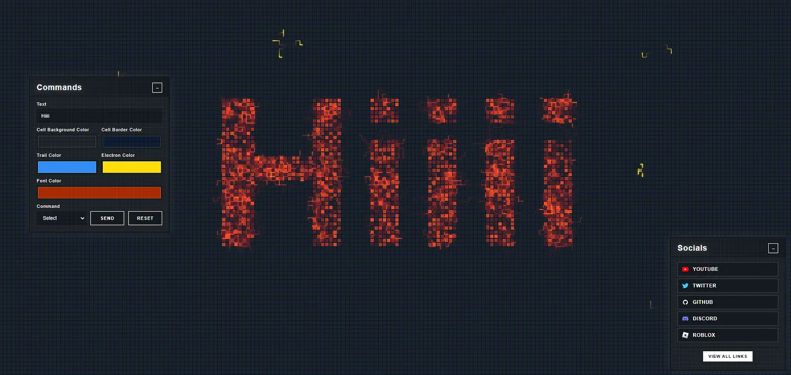

# My Portfolio

Welcome to my website. This website is mainly used to show my portfolio.
I built it with React and Mantine UI because it makes it really easy to create compnents.

<!-- Replace the line below with a real screenshot or GIF of the site -->


## Try It

Visit the website **https://daintydust.github.io**

## Features

- Portfolio page showcasing personal projects with images and descriptions
- Link tree page with quick links to social profiles and other resources
- List of Roblox accounts page

## Running Locally

**Requirements:** Node.js 20+

```bash
# Install dependencies
npm install

# Start the dev server
npm run dev
```

Then open [http://localhost:5173](http://localhost:5173) in your browser.


## How It Works

The site is a React SPA (using React Router) bundled by Vite. Mantine provides the component library, like the carousel on the portfolio page and the lightbox for project images.

## Built With

- **Mantine**: UI library for React to easily create UI components.
- **Vite**: Build tool and dev server.
- **React Router**: Client-side routing.
- **Visual Studio Code**: Development environment to write code.
- **GitHub Pages**: Hosts the the code for the website alias.
- **Cloudflare Pages**: Hosts the website and the domain.
